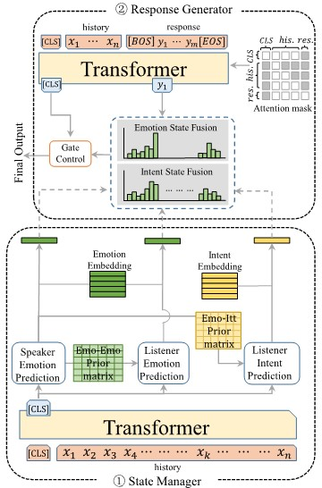

## Source code for our paper "Empathetic Response Generation with State Management"

this repository is maintained by both [Jun Gao](https://github.com/gaojun4ever/) and [Yuhan Liu](https://github.com/A-Rain), paper link: http://arxiv.org/abs/2205.03676

### Model Overview



### Environment Requirement
- pytorch >= 1.4
- sklearn
- nltk
- numpy
- bert-score


### Dataset
you can directly use the processed dataset located in `data/empathetic`:
```
├── data
│   ├── empathetic
│   │   ├── parsed_emotion_Ekman_intent_test.json
│   │   ├── parsed_emotion_Ekman_intent_train.json
│   │   ├── parsed_emotion_Ekman_intent_valid.json
│   │   ├── emotion_intent_trans.mat
│   │   ├── goEmotion_emotion_trans.mat
```

Or you want to reproduce the data annotated with *`goEmotion emotion`* classifier and *`empathetic intent`* classifier, you can run the command:

- convert raw csv empathetic dialogue data into json format. (origin dataset link: [EmpatheticDialogues](https://github.com/facebookresearch/EmpatheticDialogues))
    ```shell
    bash preprocess_raw.sh
    ```

- train emotion classfier with goEmotion dataset and annotate (origin dataset link: [goEmotion](https://github.com/google-research/google-research/tree/master/goemotions)). Here `$BERT_DIR` is your pretrained BERT model directory which includes `vocab.txt`, `config.json` and `pytorch_model.bin`, here we simply use ***bert-base-en*** from [Hugginface](https://github.com/huggingface/transformers)
    ```shell
    bash ./bash/emotion_annotate.sh  $BERT_DIR 32 0.00005 16 3 1024 2 0.1
    ```


- train intent classfier with empathetic intent dataset and annotate (origin dataset link: [Empathetic_Intent](https://github.com/anuradha1992/EmpatheticIntents))
    ```shell
    bash ./bash/intent_annotate.sh  $BERT_DIR 32 0.00005 16 3 1024 2 0.1
    ```


- build prior emotion-emotion and emotion-intent transition matrix
    ```shell
    bash ./bash/build_transition_mat.sh
    ```

### Train
For training the LM-based model, you need to download ***bert-base-en*** and ***gpt2-small*** from [Hugginface](https://github.com/huggingface/transformers) first, then run the following command. Here `$GPT_DIR` and `$BERT_DIR` are the downloaded model directory:
```shell
bash ./bash/train_LM.sh --gpt_path $GPT_DIR --bert_path $BERT_DIR --gpu_id 2 --epoch 5 --lr_NLU 0.00003 --lr_NLG 0.00008 --bsz_NLU 16 --bsz_NLG 16
```

For training the Trs-based model, we use [glove.6B.300d](https://nlp.stanford.edu/projects/glove/) as the pretrained word embeddings. You can run the following command to train model. Here `$GLOVE` is the glove embedding txt file.
```shell
bash ./bash/train_Trs.sh --gpu_id 2 --epoch 15 --lr_NLU 0.00007 --lr_NLG 0.0015 --bsz_NLU 16 --bsz_NLG 16 --glove $GLOVE
```


### Evaluate
To generate the automatic metric results, firstly you need to make sure that [bert-score](https://github.com/Tiiiger/bert_score) is successfully installed. In our paper, we use ***roberta-large-en*** rescaled with baseline to calculate BERTScore. You can download ***roberta-large-en*** from [Hugginface](https://github.com/huggingface/transformers). For the rescaled_baseline file, we can download it from [here](https://github.com/Tiiiger/bert_score/blob/master/bert_score/rescale_baseline/en/roberta-large.tsv) and put it under the ***roberta-large-en*** model directory. 

Then you can run the following command to get the result, here `$hypothesis` and `$reference` are the generated response file and ground-truth response file. `$result` is the output result file. `$ROBERTA_DIR` is the downloaded ***roberta-large-en*** model directory.

To evaluate LM-based model, the command is:
```shell
bash ./bash/eval.sh --hyp $hypothesis --ref ./data/empathetic/ref.txt --out $result --bert $ROBERTA_DIR --gpu_id 0 --mode LM
```

To evaluate Trs-based model, the command is:
```shell
bash ./bash/eval.sh --hyp $hypothesis --ref ./data/empathetic/ref_tokenize.txt --out $result --bert $ROBERTA_DIR --gpu_id 0 --mode Trs
```
